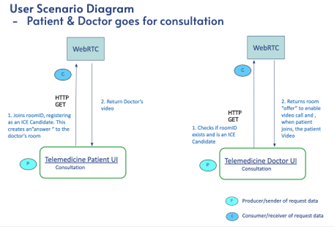
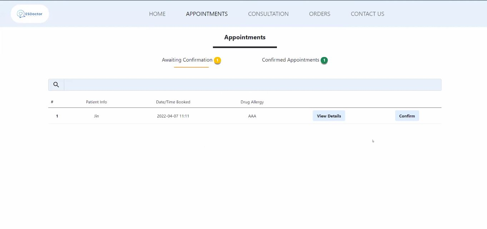
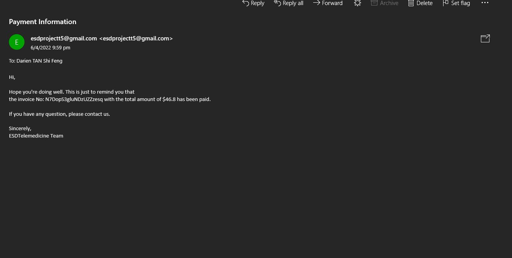

# ESDoctor
 
## 🤓 IS213 -  ESDoctor;
The team comprises of 6 web developers:

* DARIEN TAN SHI FENG (darien.tan.2020@scis.smu.edu.sg)
* Jin Ningxian (ningxianjin.2020@scis.smu.edu.sg)
* Lim Tse Hwee (tsehwee.lim.2020@scis.smu.edu.sg)
* Mabelle Tang (mabelletang.2020@scis.smu.edu.sg)
* Noah Ryan Sam (noahsam.2020@scis.smu.edu.sg)
* TAN TING CHER BENJAMIN (benjamintan.2020@scis.smu.edu.sg)

## 🤓 Project Overview ##
With the recent spike in COVID-19 cases, healthcare institutions and clinics are flooded with patients, eager to get treated. The overcrowding in physical places raises a serious concern with higher risk of transmission and stress on healthcare professionals. 

Hence, we propose for a telemedicine microservice where this platform will be able to move majority of non-critical patients to virtual consults including aftercare from COVID-19 recovery consults. This reduces the chances of transmission as well as enables flexibility for healthcare professionals to treat and prescribe relevant medication to patients remotely.

## User scenarios ##
1.	Patient books an E-consult slot with the doctor
2.	Doctor accepts booking request
3.	Patient and Doctor Goes for video call
4.	Prescribed medication is shipped to the patient address.

## Technical Overview Diagrams  ##

1.	Patient books an E-consult slot with the doctor

Scenario 1a - User signs in
 

Scenario 1b - User books appointment
 

2.	Doctor accepts booking request

Scenario 2a - Get available appointments
 

Scenario 2b - Accept appointment
 

3.	Patient and Doctor Goes for video call (consult) + medication]

Scenario 3a - Patient and doctor goes for consultation
 

Scenario 3b - Create order
 

4.	Prescribed medication is shipped to the patient address.

Scenario 4a - Get orders 
 

Scenario 4b - Update order status
 

## Technical Overview Diagrams  ##

## How to Install and Run Our Web Application (for Developers) ##

First thing to do is unzip all the files and cd to ESDTelemedicine/backend

Do check the docker-compose.yml file and change all the image names to have YOUR docker ID and not ours

To start our solution please run docker-compose up. This will build everything and run the docker components later

While running , this solution requires a frontend in order access the microservices

Hence, please use live share extension in VSC to start the frontend server

Once the frontend server is up, please navigate to index.html to begin your ESDTelemedicine journey just like our presentation.

Please note that on start, you are neither a patient, doctor nor pharmacist and right now, you are only given rights to being a patient

As such, please sign up as a patient and use your gmail account to log in to the system

You may navigate around the client as you wish.

To turn the whole system off, please run docker-compose down to turn the enterprise solution off.

## How to Use Our Web Application (Currently not live) ##

## Scenario 1 : Patient books an E-consult slot with the doctor ##

**Upon visiting our website, the user will be brought to the sign in page. If the user is a new visitor, he will be prompted to fill in his address, medical history, drug allergies and contact number. If the user already has an account, he will be brought directly to the homepage.**

**When the user is signed in, the user will be brought directly to the homepage where he would be able to see different pages he would be able to navigate to.**

**By clicking the appointment page, he will be brought to the appointment dashboard. The dashboard helps the user to view upcoming and past appointments**

**Clicking the new appointment button to schedule an appointment with the doctor, he will be brought to the webpage where a form will be required to fill up.**
*We are making an assumption here that the user is only allowed to make an appointment within the day since a patient only sees the clinic when he/she is sick.*

**The dashboard will be updated with his upcoming appointment**

## Scenario 2 : Doctor accepts booking request ##

**Similarly, the doctor is required to sign in via Google. However, only those who are registered as doctors in the firebase are entitled to sign in.**

**Appointment page will differ from that of patient's. Doctor's appointment page displays appointments that are awaiting confirmation and those that have been confirmed before.**

**After the doctor has confirmed the appointment, the record will be moved to "Confirmed Appointments" page and an email will be sent to the patient about the confirmation.**

**An example of an email that will be sent.**

## Scenario 3 : Patient and Doctor Goes for video call (consult) + medication] ##

**Doctor and patient will then communicate via the Consultation page.**

**Upon ending the video call, the doctor's webpage will be directed to the prescription page where he will prescribe the drugs.**

**Next, the patient will be able to see an overview of the reciept and the drugs that the doctor have prescriped.**

**The patient will then proceed to pay by clicking the button located at the bottom of the webpage.**

**Furthermore, an invoice will be sent to the patient.**

## Scenario 4 : Prescribed medication is shipped to the patient address. ##

**Similarly, the pharmacists is required to sign in via Google. However, only those who are registered as pharmacists in the firebase are entitled to sign in.**

**Upon logging in, pharmacists homepage will appear differently from the other 2 role's homepages. Pharmacists homepage only requires the "Orders" page.**

**The pharmacists will proceed to prepare the drugs by clicking on the "View details" button.**

**After preparing the drugs, the pharmacists will be directed back to the "Orders" page after clicking the "Prepare" button.**

**In addition, an email will be sent to the patient that the order has been confirmed.**

## Full Video: ##

